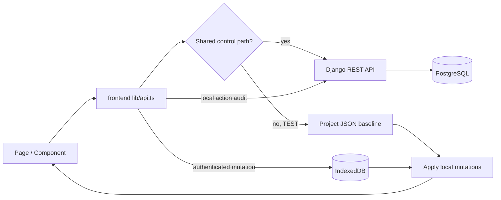
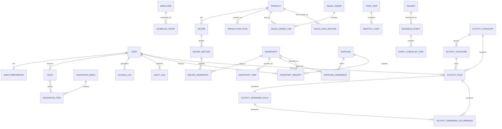

# BakeOps 数据架构

> 状态基准：2026-08-22。本文以当前模型、迁移和前端数据路由为准。

## 1. 数据分类与所有权

BakeOps 并不是“测试库和生产库两套 PostgreSQL”。当前架构按数据责任拆分：共享控制数据始终在 PostgreSQL；生产业务数据在 PostgreSQL；测试业务数据在浏览器本地。

| 数据类别 | 示例 | 测试模式 | 生产模式 | 是否共用 |
| --- | --- | --- | --- | --- |
| 身份与偏好 | 用户、Session、语言、主题、用户系统模式 | PostgreSQL | PostgreSQL | 是 |
| 权限与导航 | 角色、页面权限、菜单树 | PostgreSQL | PostgreSQL | 是 |
| 日志与审计 | 页面访问、API 访问、增删改、登录事件 | PostgreSQL | PostgreSQL | 是，记录 `system_mode` |
| 业务主数据 | 产品、食材、供应商、员工 | 项目 JSON 基线 + IndexedDB | PostgreSQL | 否 |
| 业务交易数据 | 排班、生产计划、进货、销售、成本、活动与提醒 | 项目 JSON 基线 + IndexedDB | PostgreSQL | 否 |

游客固定读取测试业务数据，且不能保存本地增删改。登录用户根据共享用户表中的 `system_mode` 选择测试或生产业务数据。

## 2. 测试模式读取与写入

测试读取使用仓库 `frontend/src/data/test/` 内的固定 JSON 基线，再按集合根路径合并 IndexedDB 变更：新增记录插入、更新记录浅合并、删除记录移除。测试业务接口缺少本地基线时会明确报错，不会回退读取 PostgreSQL 生产业务数据。

测试写入不会调用生产业务接口，但会向共享审计接口发送动作元数据。浏览器本地变更通过数据变更事件通知当前页面刷新。清除该站点的 IndexedDB 会丢失本浏览器的测试修改，页面随后恢复项目 JSON 基线，不会修改或重新读取 PostgreSQL 生产业务数据。

## 3. 生产与测试数据量

> 统计时间：2026-08-22。生产数量来自当前 PostgreSQL `bakeops` 数据库；非共用测试数量来自项目 JSON 基线。共用表在两种模式下读取同一批 PostgreSQL 记录，因此两列相同。此表是时点快照，生产写入或本浏览器 IndexedDB 修改不会自动改写文档。
>
> 路径缩写：`PG/<表名>` 表示 PostgreSQL `bakeops` 数据库的 `public.<表名>`；`TEST/<文件>` 表示 `/Volumes/JoeDisk/Project/BakeOps/frontend/src/data/test/<文件>`。`+ IndexedDB` 表示登录用户的测试修改叠加保存在当前浏览器。

| 表名 | 生产模式数据量 | 测试模式数据量 | 是否共用 | 存放路径 |
| --- | ---: | ---: | :---: | --- |
| `access_role` 角色 | 4 | 4 | 是 | `PG/access_role` |
| `access_role_pages` 角色页面权限 | 48 | 48 | 是 | `PG/access_role_pages` |
| `audit_access_log` 访问日志 | 3,875 | 3,875 | 是 | `PG/audit_access_log` |
| `audit_audit_log` 操作审计 | 184 | 184 | 是 | `PG/audit_audit_log` |
| `auth_group` Django 用户组 | 0 | 0 | 是 | `PG/auth_group` |
| `auth_group_permissions` 用户组权限 | 0 | 0 | 是 | `PG/auth_group_permissions` |
| `auth_permission` 权限定义 | 174 | 174 | 是 | `PG/auth_permission` |
| `costs_costitem` 成本项目配置 | 13 | 10 | 否 | 生产：`PG/costs_costitem`；测试：`TEST/cost-items.json` + IndexedDB |
| `costs_costmonth` 成本月份 | 9 | 1 | 否 | 生产：`PG/costs_costmonth`；测试：`TEST/cost-months.json` + IndexedDB |
| `costs_monthlycost` 月度成本 | 90 | 10 | 否 | 生产：`PG/costs_monthlycost`；测试：`TEST/monthly-costs.json` + IndexedDB |
| `django_admin_log` Django 管理日志 | 0 | 0 | 是 | `PG/django_admin_log` |
| `django_content_type` Django 模型类型 | 40 | 40 | 是 | `PG/django_content_type` |
| `django_migrations` 数据库迁移 | 79 | 79 | 是 | `PG/django_migrations` |
| `django_session` 登录会话 | 6 | 6 | 是 | `PG/django_session` |
| `employees_employee` 员工 | 6 | 6 | 否 | 生产：`PG/employees_employee`；测试：`TEST/employees.json` + IndexedDB |
| `events_activitycategory` 活动分类 | 7 | 5 | 否 | 生产：`PG/events_activitycategory`；测试：`TEST/activity-categories.json` + IndexedDB |
| `events_activityplatform` 活动平台 | 15 | 9 | 否 | 生产：`PG/events_activityplatform`；测试：`TEST/activity-platforms.json` + IndexedDB |
| `events_activityplan` 活动计划 | 0 | 3 | 否 | 生产：`PG/events_activityplan`；测试：`TEST/activity-plans.json` + IndexedDB |
| `events_activityplan_focus_products` 活动计划重点产品 | 0 | 0 | 否 | 生产：`PG/events_activityplan_focus_products`；测试：`TEST/activity-plan-focus-products.json` + IndexedDB |
| `events_activityreminderrule` 活动提醒规则 | 0 | 3 | 否 | 生产：`PG/events_activityreminderrule`；测试：`TEST/activity-reminder-rules.json` + IndexedDB |
| `events_activityreminderoccurrence` 活动提醒执行 | 0 | 0 | 否 | 生产：`PG/events_activityreminderoccurrence`；测试：`TEST/activity-reminder-occurrences.json` + IndexedDB |
| `events_businessclosure` 停业安排 | 0 | 2 | 否 | 生产：`PG/events_businessclosure`；测试：`TEST/business-closures.json` + IndexedDB |
| `events_businessevent` 经营活动 | 0 | 5 | 否 | 生产：`PG/events_businessevent`；测试：`TEST/business-events.json` + IndexedDB |
| `events_businessevent_focus_products` 经营活动重点产品 | 0 | 13 | 否 | 生产：`PG/events_businessevent_focus_products`；测试：`TEST/business-event-focus-products.json` + IndexedDB |
| `events_eventchecklistitem` 活动检查事项 | 0 | 75 | 否 | 生产：`PG/events_eventchecklistitem`；测试：`TEST/event-checklist-items.json` + IndexedDB |
| `events_holiday` 节假日 | 11 | 11 | 否 | 生产：`PG/events_holiday`；测试：`TEST/holidays.json` + IndexedDB |
| `inventory_inventoryitem` 库存食材 | 0 | 103 | 否 | 生产：`PG/inventory_inventoryitem`；测试：`TEST/inventory-items.json` + IndexedDB |
| `inventory_inventoryreceipt` 进货记录 | 0 | 1,511 | 否 | 生产：`PG/inventory_inventoryreceipt`；测试：`TEST/inventory-receipts.json` + IndexedDB |
| `inventory_productionplan` 生产计划 | 0 | 145 | 否 | 生产：`PG/inventory_productionplan`；测试：`TEST/production-plans.json` + IndexedDB |
| `inventory_purchaserequest` 采购申请 | 0 | 0 | 否 | 生产：`PG/inventory_purchaserequest`；测试：`TEST/purchase-requests.json` + IndexedDB |
| `navigation_navigationitem` 菜单项目 | 32 | 32 | 是 | `PG/navigation_navigationitem` |
| `navigation_navigationmenu` 菜单分组 | 2 | 2 | 是 | `PG/navigation_navigationmenu` |
| `products_ingredient` 食材 | 48 | 103 | 否 | 生产：`PG/products_ingredient`；测试：`TEST/ingredients.json` + IndexedDB |
| `products_product` 产品 | 8 | 37 | 否 | 生产：`PG/products_product`；测试：`TEST/products.json` + IndexedDB |
| `products_recipe` 配方 | 8 | 37 | 否 | 生产：`PG/products_recipe`；测试：`TEST/recipes.json` + IndexedDB |
| `products_recipeingredient` 配方食材 | 69 | 318 | 否 | 生产：`PG/products_recipeingredient`；测试：`TEST/recipe-ingredients.json` + IndexedDB |
| `products_recipesection` 配方组成部分 | 16 | 48 | 否 | 生产：`PG/products_recipesection`；测试：`TEST/recipe-sections.json` + IndexedDB |
| `sales_salesdatarecord` 每日渠道产品销售汇总 | 0 | 7,950 | 否 | 生产：`PG/sales_salesdatarecord`；测试：`TEST/sales-data.json` + IndexedDB |
| `sales_salesorder` 销售订单（兼容模型） | 0 | 0 | 否 | 生产：`PG/sales_salesorder`；测试：`TEST/sales-orders.json` + IndexedDB |
| `sales_salesorderline` 销售明细（兼容模型） | 0 | 0 | 否 | 生产：`PG/sales_salesorderline`；测试：`TEST/sales-order-lines.json` + IndexedDB |
| `scheduling_scheduleentry` 排班 | 5 | 1,510 | 否 | 生产：`PG/scheduling_scheduleentry`；测试：`TEST/schedules.json` + IndexedDB |
| `suppliers_supplier` 供应商 | 0 | 50 | 否 | 生产：`PG/suppliers_supplier`；测试：`TEST/suppliers.json` + IndexedDB |
| `suppliers_supplieringredient` 供应商供货关系 | 0 | 156 | 否 | 生产：`PG/suppliers_supplieringredient`；测试：`TEST/supplier-ingredients.json` + IndexedDB |
| `users_user` 系统用户和用户系统模式 | 4 | 4 | 是 | `PG/users_user` |
| `users_user_groups` 用户组关系 | 0 | 0 | 是 | `PG/users_user_groups` |
| `users_user_roles` 用户角色关系 | 4 | 4 | 是 | `PG/users_user_roles` |
| `users_user_user_permissions` 用户直接权限 | 0 | 0 | 是 | `PG/users_user_user_permissions` |
| `users_userpreference` 用户界面偏好 | 4 | 4 | 是 | `PG/users_userpreference` |

## 4. 服务端关系模型

所有后端领域模型继承 `BaseModel`，默认包含 UUID 主键、`created_at` 和 `updated_at`。关键关系如下：

完整可编辑的 Mermaid 关系图位于 [bakeops-data-structure.mmd](../diagrams/bakeops-data-structure.mmd)。

## 5. 领域数据说明

### 身份、权限和导航

- `User`：邮箱登录标识、角色集合、保护标记和 `system_mode`。
- `UserPreference`：一对一保存主题、语言、时区、日期格式和界面偏好。
- `Role`：通过多对多关系授权 `NavigationItem`；匿名角色决定游客页面范围。
- `NavigationMenu` / `NavigationItem`：菜单树、页面键、路径、中英文标签、位置和版本号。

### 产品、采购和库存

- `Product -> Recipe -> RecipeSection -> RecipeIngredient` 表达产品 BOM；食材通过 UUID 关联。
- `SupplierIngredient` 是供应商与食材的关联实体，保存报价、计价单位、MOQ、交期及首选状态。
- `InventoryReceipt` 是实际进货事实，并保留录入人、采购单价和发票附件信息。
- `InventoryItem` 保存当前库存聚合状态；`ProductionPlan` 驱动配方需求、库存覆盖和物料成本计算。

### 员工和排班

- `Employee` 是业务员工档案，不等于系统登录用户。
- `ScheduleEntry` 关联员工并保存日期、起止时间、休息分钟和工作内容。
- 排班是计划数据，不能直接当作实际考勤事实；现有工资估算仍基于排班，后续应由实际考勤替代。

### 销售和成本

- `SalesOrder` / `SalesOrderLine` 保留订单粒度兼容模型。
- `SalesDataRecord` 是当前销售数据主口径：每一行代表某日、某渠道、某产品的汇总。
- `CostItem` 是成本分类主数据；`MonthlyCost` 保存实际发生日期与月份快照。
- 盈利分析从销售汇总、生产材料成本、排班工资估算和月度经营成本聚合，不持久化重复的利润事实。

### 经营活动与活动策划

- `BusinessEvent` 管理节假日关联、经营影响和准备清单；`BusinessClosure` 管理休息与停业。
- `ActivityCategory` 和 `ActivityPlatform` 是活动分类与平台字典。
- `ActivityPlan` 保存名称、分类、平台、负责人、有效日期、优先级和状态。
- `ActivityReminderRule` 与计划一对一，保存频率、间隔、星期、多选月份日期、提醒时间和时区。
- `ActivityReminderOccurrence` 保存每次计划执行事实，包括完成、跳过、取消、顺延、执行备注和结果链接。

## 6. 关键约束与历史完整性

- UUID 是默认主键；显示名称不参与外键关联。
- 用户邮箱有不区分大小写的唯一约束。
- 活动、停业和活动计划的结束日期不得早于开始日期。
- 每条活动计划只有一条提醒规则；`(rule, scheduled_at)` 唯一，确保提醒幂等生成。
- 每种食材最多有一个有效首选供应商。
- 删除受历史记录引用的数据时，使用 `PROTECT`、`SET_NULL`、级联或业务校验按领域语义处理。
- 财务与重量字段使用 `Decimal`；时区默认 `Europe/London`。

## 7. 日志数据

`AccessLog` 保存页面访问和 API 访问；`AuditLog` 保存增删改、登录、退出、登录失败及权限拒绝。两者共享：

- 用户、游客 UUID、Session、请求 UUID；
- `system_mode`、菜单键、资源类型与资源 ID；
- HTTP 方法、路径、状态码、成功状态和耗时；
- 设备、操作系统、浏览器和 User-Agent；
- IP 哈希和可信代理提供的粗粒度位置；
- 保留期限字段。

高频相同事件按身份、动作、路径和模式进行时间窗口去重。日志清理由 `purge_expired_audit_logs` 管理命令按保留期限批量执行。

## 8. 备份与恢复

- PostgreSQL 使用 `pg_dump` / `pg_restore` 做逻辑备份和恢复，不直接复制数据库数据目录。
- 项目 JSON 保存测试业务基线；每个浏览器的测试修改保存在该浏览器 IndexedDB 中，两者都不包含在 PostgreSQL 备份中。
- 生产恢复后必须校验迁移状态、关键表行数、超级管理员登录、页面权限、业务查询和日志写入。
- 备份脚本及生产部署细节见仓库 `scripts/` 和 [生产部署说明](../deployment-production.md)。

## 9. 变更规则

修改数据模型时必须同时更新 Django migration、序列化校验、权限、自动化测试和本文。新增测试模式业务接口时，还必须定义其本地种子、读取兼容策略、IndexedDB 集合根路径和游客写入限制。
