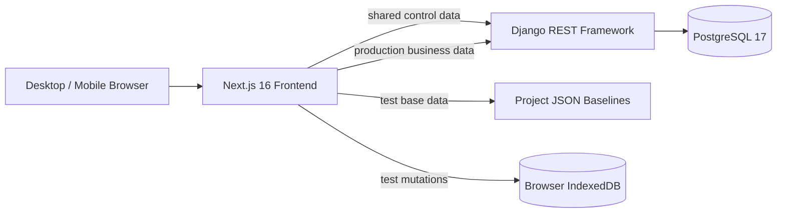
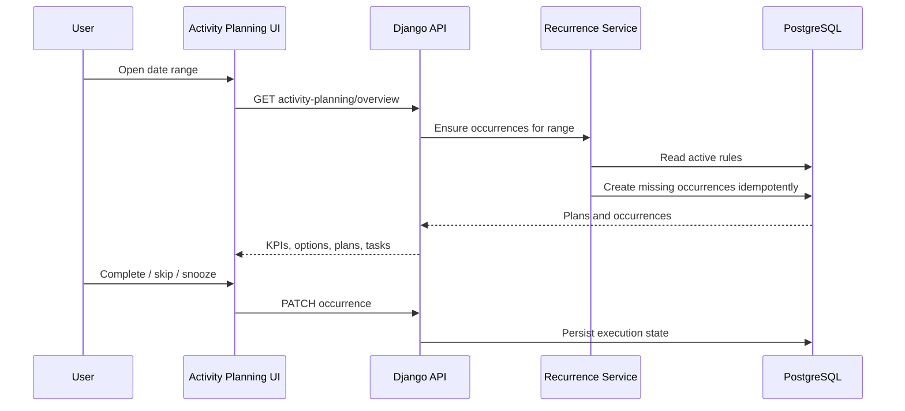

# BakeOps 项目架构

> 状态基准：2026-08-22。本文描述当前代码已经实现的架构，不代表未来路线图。

## 1. 系统边界

BakeOps 是面向单店餐饮运营的响应式 Web 管理系统，覆盖用户与权限、员工、排班、产品配方、供应商、库存、采购入库、生产计划、销售、成本、经营分析、经营活动、活动策划和日志审计。当前不包含合同、车辆或运输管理。

系统采用单体仓库、前后端分离和领域模块化结构。Next.js 负责页面与客户端状态，Django REST Framework 负责共享控制数据、生产业务数据、认证、权限、校验和审计，PostgreSQL 保存服务端关系数据。

## 2. 运行拓扑

本地开发由 `compose.yaml` 编排三个容器：

| 服务 | 容器 | 职责 | 默认端口 |
| --- | --- | --- | --- |
| `frontend` | `BO-frontend` | Next.js 开发服务器和同源 API 代理 | `${FRONTEND_PORT:-3000}` |
| `backend` | `BO-backend` | Django API、认证、权限、迁移和业务规则 | `${BACKEND_PORT:-8000}` |
| `postgres` | `BO-postgres` | PostgreSQL 关系数据库 | `${POSTGRES_PORT:-5432}` |

代码通过移动硬盘目录 `/Volumes/JoeDisk/Project/BakeOps` 绑定挂载；PostgreSQL 使用命名卷 `BO-postgres-data`。启动 Docker 前必须确保移动硬盘已经挂载。

## 3. 前端架构

前端采用 Next.js App Router。路由位于 `frontend/src/app`，领域组件位于 `frontend/src/components`，所有服务端请求与测试数据路由集中在 `frontend/src/lib/api.ts`。

关键基础设施：

- `DashboardShell`：顶部栏、响应式侧边栏和内容布局。
- `AuthProvider`：Session 登录状态、多页签登录同步、游客路由守卫和用户数据模式初始化。
- `AppPreferencesProvider`：语言、主题、时区、日期格式和侧边栏偏好。
- `apiRequest`：CSRF、同源 API、系统模式请求头、测试数据读取和本地变更审计的统一入口。
- `local-test-seed.ts`：已打包的合成测试数据和按查询参数过滤的本地读取。
- `local-test-db.ts`：IndexedDB 中的每浏览器测试增删改变更和旧版兼容快照。

所有测试业务接口必须使用 `frontend/src/data/test/` 的项目 JSON 基线，后续读取叠加本地变更。测试业务接口缺少基线时直接报错，不会请求后端生产业务数据；清空浏览器存储后会恢复相同的项目基线。

新增页面应复用现有 UI 组件、统一 API 层和中英文偏好，不应在页面组件内直接调用不同数据源。

## 4. 后端架构

Django 按领域拆分应用：

| 应用 | 职责 |
| --- | --- |
| `users` | 邮箱登录、自定义用户、用户模式与偏好 |
| `access` | 角色、页面授权和匿名访问角色 |
| `navigation` | 数据库驱动的菜单树、顺序和中英文标签 |
| `audit` | 页面访问、API 访问和操作审计 |
| `employees` / `scheduling` | 员工档案与排班 |
| `products` | 产品、食材、配方、分区和配方食材 |
| `suppliers` | 供应商及可供应食材条件 |
| `inventory` | 库存、生产计划、采购申请和进货记录 |
| `sales` | 订单行与按日、渠道、产品汇总的销售数据 |
| `costs` | 成本项目和月度成本 |
| `events` | 经营活动、停业、活动策划及循环提醒 |

每个领域通常包含模型、序列化器、视图、URL、权限、迁移和测试。数据约束同时在序列化器与数据库层表达；敏感权限必须在后端校验。

## 5. 认证、权限与多页签

系统使用 Django Session Cookie 与 CSRF，不使用 JWT。邮箱是不区分大小写的唯一登录标识。用户可拥有多个角色，页面权限取所有有效角色页面权限的并集；超级管理员不受页面菜单限制。

游客使用受保护的匿名角色访问被授权页面。游客固定为测试模式，前端拒绝其增删改。登录用户的 `system_mode` 保存在共享 `users_user` 表中，同一浏览器的多个页签共享 Session；任一页签登录或退出后，通过浏览器存储事件触发其他页签刷新认证状态。

## 6. 数据模式路由

数据分为两类：

1. 共享控制数据：账户、角色、页面权限、菜单、用户偏好、系统配置和日志。测试与生产模式都使用 Django/PostgreSQL。
2. 业务数据：产品、员工、排班、库存、进货、生产、销售、成本和活动等。生产模式使用 Django/PostgreSQL；测试模式使用项目 JSON 基线，再叠加 IndexedDB 变更。

前端向服务端请求附带 `X-BakeOps-System-Mode`，用于日志标记和服务端上下文。数据隔离的详细规则见 [数据架构](data-architecture.md)。

## 7. 活动策划与提醒流程

`ActivityPlan` 保存活动本身，`ActivityReminderRule` 保存一次、每日、每周或每月规则，`ActivityReminderOccurrence` 保存每次具体执行事实。`(rule, scheduled_at)` 唯一约束保证重复读取同一日期范围不会重复生成提醒。

测试模式在浏览器中使用同样的规则生成提醒，并将完成、跳过和顺延作为本地变更保存；生产模式由后端生成并写入 PostgreSQL。

## 8. 日志与审计

前端页面访问通过专用接口记录；后端中间件记录 API 读取、增删改、登录、退出、失败登录和权限拒绝。日志保存用户或游客标识、系统模式、菜单键、路径、资源、状态码、耗时、设备、操作系统、浏览器和 IP 哈希。

高频访问与安全事件使用缓存窗口去重，日志写入失败不会中断正常业务请求。原始 IP 不落库；位置字段只读取可信代理传入的国家、地区和城市头，不主动调用第三方定位服务。

## 9. 工程与部署约束

- 模型变更必须包含 Django migration。
- 用户可见文案必须同时支持 `zh-CN` 与 `en-GB`。
- 金额、成本和重量使用 `Decimal`，禁止用浮点数保存财务事实。
- 历史关联优先使用 `PROTECT`、`SET_NULL` 或软删除，避免破坏历史事实。
- 前端检查：ESLint、TypeScript；后端检查：Django check、pytest、Ruff、mypy。
- 生产部署配置与安全边界见 [生产部署说明](../deployment-production.md)。

## 10. 架构图维护

[功能架构 Mermaid 源文件](../diagrams/bakeops-functional-architecture.mmd) 是可维护的文本基准。跨模块流程或数据模式发生变化时，应同步更新本文、数据架构文档和 Mermaid 源图；Draw.io 文件用于人工展示和编辑，不作为代码实现状态的唯一依据。
